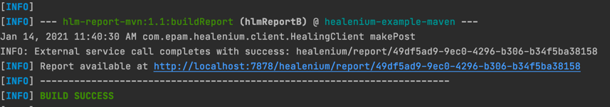
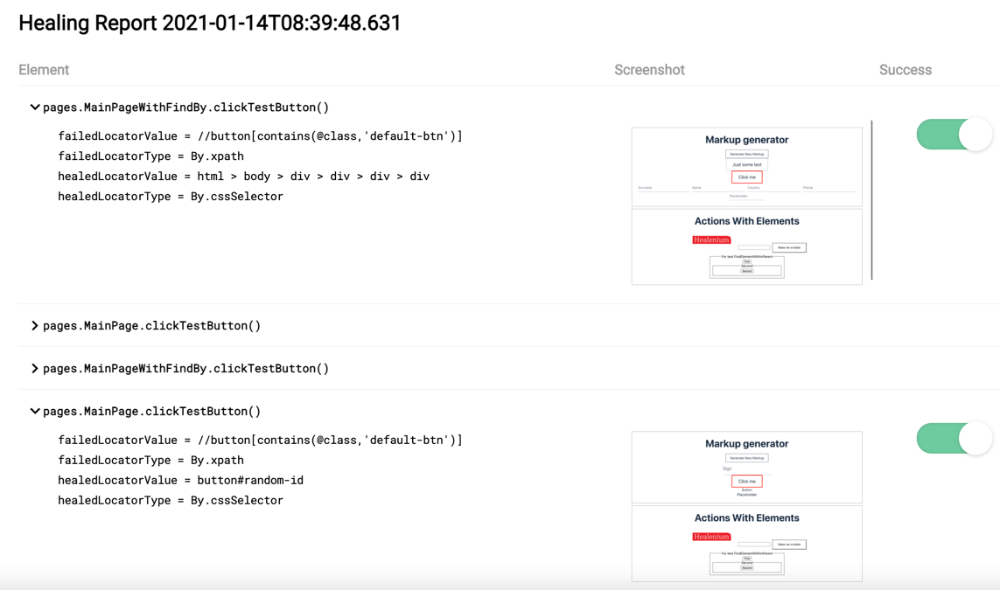
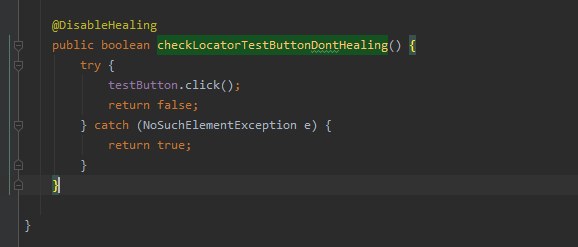
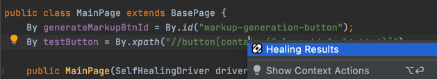
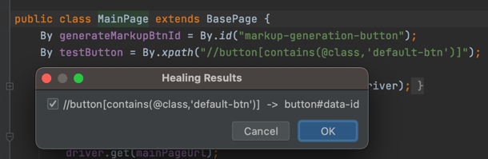

# healenium-example-maven
Java + Maven + Junit5 project with healenium usage example 

### To setup Healenium see the tutorial: https://www.youtube.com/watch?v=Ed5HyfwZhq4

## How to start
### 1.Start Healenium backend from infra folder

```cd infra```

```docker-compose up -d```

To download this file into your project use this command:

```$ curl https://raw.githubusercontent.com/healenium/healenium-example-maven/master/infra/docker-compose.yml -o docker-compose.yml```

Create /db/sql folder on the same level in your project. Add init.sql file into ./db/sql/init.sql folder in your project via command:

```$ curl https://raw.githubusercontent.com/healenium/healenium-client/master/example/init.sql -o init.sql```

Verify that images ```healenium/hlm-backend:3.2.5``` and ```postgres:11-alpine```  and ```healenium/hlm-selector-imitator:1.1``` are up and running

### 2. Project structure
```
|__infra
    |__db/sql
        |__init.sql
    |__docker-compose.yml
|__src/main/java/
|__src/test/java/
|__pom.xml
``` 
			   
### 3.Run test in terminal with maven

In ```BaseTest.java``` class select necessary driver: **LOCAL**, **PROXY** or **REMOTE** and browser to run: chrome, firefox or edge.

```driver = new DriverContext(DriverType.LOCAL).getDriver(BrowserType.CHROME);```

**LOCAL** - used for local run. It's been set by default in BaseTest.java class. For this driver should be used docker-compose file from test example.

**PROXY** - used if you're running tests using healenium-proxy. For this driver you need to set docker-compose containers as in example by link:
https://github.com/healenium/healenium-example-dotnet/blob/master/infra/docker-compose.yml

**REMOTE** - used if you-re running test on remote machine. Do not forget to provide necessary host. In this test example it's been used remote machine with Selenoid.

In ```BaseTest.java``` class select necessary framework: **SELENIUM** or **SELENIDE**.

```pages = new FrameworkContext(FrameworkType.SELENIDE, driver).setFramework();```

If you want to execute all tests, please use the command: ```mvn clean test```
 

### 4.After test execution you should see generated report link in command line logs



Report contains only healed locators with old-new values and a button that tells if healing was successful for further algorithm corrections



### 5. Screenshots 

Also you could take a screenshots for your com.epam.healenium.tests like it implements here: BaseTest.screenshot
```
  public byte[] screenshot() {
      return ((TakesScreenshot) driver.getDelegate()).getScreenshotAs(OutputType.BYTES);
  }
```
### 6. @DisableHealing annotation

If don't want to use Healenium in some methods just use @DisableHealing annotation. 
> The example of usage you can find here: MainPageWithFindBy.checkLocatorTestButtonDontHealing 



### 7. Plugin Healenium for Intellij IDE

For updating broken locators you could use Plugin "Healenium" for Intellij IDE (https://plugins.jetbrains.com/plugin/14178-healenium).

With this plugin you can update your locators:
* on class level


* or on variable level




